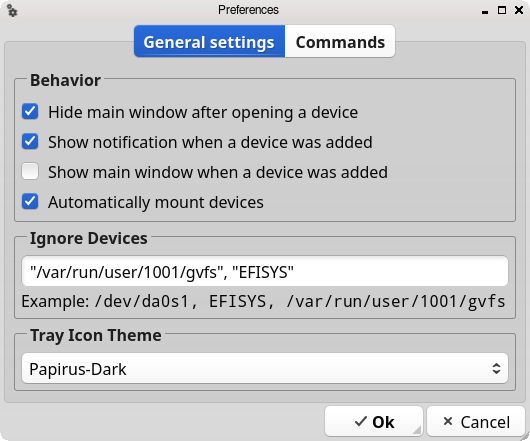

:toc:
:toc-position: preamble
:toclevels: 4
ifdef::env-github[]
:tip-caption: :bulb:
:note-caption: :information_source:
:important-caption: :heavy_exclamation_mark:
:caution-caption: :fire:
:warning-caption: :warning:
endif::[]

= DSBMC - Graphical Client for DSBMD

toc::[]

== About

_DSBMC_ is a Qt5 client which allows accessing the functions the mounting
daemon https://github.com/mrclksr/DSBMD[DSBMD] provides, like
mounting/unmounting media and disk images, and setting the reading speed of
CD/DVD drives.

== Installation

=== Building from Source

==== Dependencies

* https://freshports.org/devel/qt5-buildtools[devel/qt5-buildtools]
* https://freshports.org/devel/qt5-core[devel/qt5-core]
* https://freshports.org/devel/qt5-linguisttools[devel/qt5-linguisttools]
* https://freshports.org/devel/qt5-qmake[devel/qt5-qmake]
* https://freshports.org/x11-toolkits/qt5-gui[x11-toolkits/qt5-gui]
* https://freshports.org/x11-toolkits/qt5-widgets[x11-toolkits/qt5-widgets]

==== Getting the Source Code

[source,sh]
----
% git clone https://github.com/mrclksr/DSBMC.git
----

==== Building and Installation

[source,sh]
----
# cd DSBMC && qmake
# make && make install
----

=== Installing via _pkg(8)_

[source,sh]
----
# pkg install dsbmc
----

=== Installing from the FreeBSD Ports

[source,sh]
----
# cd /usr/ports/sysutils/dsbmc
# make install distclean
----

=== Installation and Quick Setup of the Mouting Daemon (DSBMD)

Install _DSBMD_ via _pkg(8)_

[source,sh]
----
# pkg install dsbmd
----

or via the FreeBSD Ports

[source,sh]
----
# cd /usr/ports/sysutils/dsbmd
# make install distclean
----

Enable `vfs.usermount`

[source,sh]
----
# sysctl vfs.usermount=1
----

and make it permanent by adding the line `vfs.usermount=1` to
`/etc/sysctl.conf`:

[source,sh]
----
# echo 'vfs.usermount=1' >> /etc/sysctl.conf
----

This allows DSBMD to mount media as regular user, and it allows you to
unmount devices you mounted without having special privileges. That is,
you can unmount media using your file manager.

Finally, enable DSBMD in `/etc/rc.conf`, and start it

[source,sh]
----
# sysrc dsbmd_enable=YES
# service dsbmd start
----

== Usage

=== The Main Window

Each device which can be mounted by _DSBMD_ is represented by an icon matching
the device type (CD/DVD, HDD, USB disk, MMC SD card, PTP (camera), MTP), and
a label. If possible, the volume label of the device is used. Otherwise, the
name of the device node (e.g. `da0p1`) is used. Mounted devices are represented
by a folder icon.

The status bar at the bottom of the main window shows the device node name,
the capacity, and the number of free bytes of the selected device. The number
of free bytes is 0 if the device is a CD/DVD or if it's not mounted. Depending
on the size, the unit is GB, MB, or KB.

=== The Tray Icon

The visibility of the main window can be toggled by pressing _DSBMC_'s tray
icon. Pressing the window's close button will minimize it to tray. Every time
a new device is added to the system, the main window and a balloon message
pops up. You can control this behavior under _File_ -> _Preferences_ ->
_General settings_ -> _Behavior_. The theme used for the tray icon can
be changed under _File_ -> _Preferences_ -> _Tray Icon Theme_.

=== Mounting and Unmounting Devices, Playing Media, etc.

Each device icon provides a context menu which offers the possible actions
of a device, like _Mount_, _Unmount_, _Play_, etc. Except for audio CDs, all
device icons can be double-clicked to mount the device and open its mount
point in a filemanager. The commands for opening mount points (filemanager)
and playing media can be defined under _File_ -> _Preferences_ -> _Commands_.

=== Mounting Disk Image Files

The mounting daemon (_DSBMD_) accesses disk image files through the memory
disk interface (`md(4)`). You can open an image file via filemanager,
by letting it open the file with _DSBMC_, or you can use the command line:

[source,sh]
----
% dsbmc /path/to/image/file.img
----

One or more `md` devices will appear in the main window, which you can mount
like any other device.

=== Ejecting Media and Devices

Depending on the type of device, the _Eject_ action behaves differently:

==== CD/DVD

If mounted, the CD/DVD is first umounted, and then the CD/DVD tray is ejected.

==== USB Mass Storage Devices

If mounted, the device is first unmounted, and then detached from the CAM
subsystem. This flushed all the device's caches and makes sure pending data
gets written. Finally, the device node will be removed.

[TIP]
====
Eject your _Kindle_ if you want to use it while charging on your computer.
====

==== Disk Images

If mounted, the memory disk (`md`) is first unmounted, and then detached from
its backing store (image file). Finally, the device node will be removed.

=== Automounting Devices

If you want devices to be automatically mounted when they are inserted, you
can enable _automount_ under _File_ -> _Preferences_ -> _Behavior_.

=== Ignoring Devices or Mount Points

If you don't want certain devices, partitions, or mount points to appear
in the main window, like EFI partitions, you can add the device's node
path (e.g. `/dev/da0s1`) to the comma separated _Ignore Devices_ list under
_File_ -> _Preferences_ -> _Ignore Devices_. It is also possible to use
the device's volume Label (e.g. `EFISYS`).

=== Autoplaying Media

If you want CD/DVDs to be played automatically when inserted, you can enable
_Autoplay_ for each media type separately under _File_ -> _Preference_ ->
_Commands_.

=== Command-Line

==== Usage

*dsbmc* [-*hi*] [*<disk image>* ...]

==== Options

-i::	Start _DSBMC_ as tray icon without showing the main window.
-h::	Help message.

If a disk image is given, a *md(4)* device is created from it.

== Development

=== Contributing Translations

==== Available Translations

* German

==== Instructions

Let's say you want to add translations for Russian, you can proceed as follows:

. Create a fork of this repo, and clone it:
+
[source,sh]
----
% git clone url-of-your-fork
----
. Install `devel/qt5-linguist` and `devel/qt5-linguisttools`
. `cd` to `your-forked-dsbmc-dir`
. Add `locale/$${PROGRAM}_ru.ts` to `TRANSLATIONS` in `dsbmc.pro`.
. Execute `lupdate dsbmc.pro`
. Run `linguist locale/dsbmc_ru.ts`
. Add the file to the repo: `git add locale/dsbmc_ru.ts`
. Commit: `git commit -am 'Add Russian translations.'`
. Send a pull request.

[[look]]
== Configuring the Look and Behavior of Qt5 Applications

If you are not using a desktop environment like KDE or GNOME, there are
two ways to control the appearance of Qt5 applications:

* <<kvantum,qt5ct and the Kvantum theme engine>>
* <<qt5-style-plugins,Qt5-style-plugins>>

[[kvantum]]
=== qt5ct and the Kvantum theme engine

==== qt5ct

https://freshports.org/misc/qt5ct[_qt5ct_] is a tool that allows you to
configure themes, fonts, and icons of Qt5 applications.
It can be installed via `pkg`

[source,sh]
----
# pkg install qt5ct
----

or via the FreeBSD ports:

[source,sh]
----
# cd /usr/ports/misc/qt5ct
# make install
----

In order to make Qt5 applications use _qt5ct_, add the line
`export QT_QPA_PLATFORMTHEME=qt5ct` to one of the following files, depending
on how you start your X session:

[[session_files]]
.Session Files
[options="header,footer"]
|==================================================
|X Session Start Method           |File
|_SliM_, _startx_, _xinit_        |`~/.xinitrc`
|_GDM_, _LightDM_, _LXDM_, _SDDM_ |`~/.xprofile`
|_WDM_, _XDM_                     |`~/.xsession`
|==================================================

Alternatively, you can add the line to your window manager's startup
script, or, if you are using a Bourne shell compatible login shell, to
your `~/.profile`.

After loggin out and in again, proceed with the next section.

==== Kvantum

https://www.freshports.org/x11-themes/Kvantum[_Kvantum_] is a SVG-based theme
engine for Qt, KDE and LXQt. Install it via `pkg`:

[source, sh]
----
# pkg install Kvantum-qt5
----

or via the FreeBSD ports:

[source,sh]
----
# cd /usr/ports/x11-themes/Kvantum
# make install distclean
----

Start `qt5ct` and choose *_kvantum_* under *_Appeareance_* -> *_Style_*, and
press _Ok_.

[TIP]
====
You can use _Kvantum_ directly without _qt5ct_ by setting
`QT_STYLE_OVERRIDE=kvantum`. Note, however, that the _Kvantum Manager_
lacks the ability to change fonts and the icon theme.
====

Now you can start `kvantummanager` to set, install and configure themes.

[TIP]
====
You can download
link:https://store.kde.org/browse/cat/123/order/latest[Kvantum themes]
from https://store.kde.org[KDE Store]. Unpack them, and use the
_Kvantum Manager_ to install new themes.
====

[[qt5-style-plugins]]
=== Qt5-style-plugins

https://www.freshports.org/x11-themes/qt5-style-plugins/[Qt5-style-plugins]
is a theme engine which allows using GTK-2 themes with Qt5 applications.
Install it via `pkg`

[source,sh]
----
# pkg install qt5-style-plugins
----

or via the FreeBSD ports

[source,sh]
----
# cd /usr/ports/x11-themes/qt5-style-plugins
# make install distclean
----

In order to make Qt5 applications use qt5-style-plugins, add the line
`export QT_QPA_PLATFORMTHEME=gtk2` to one of the following files, depending
on how you start your X session:

.Session Files
[options="header,footer"]
|==================================================
|X Session Start Method           |File
|_SliM_, _startx_, _xinit_        |`~/.xinitrc`
|_GDM_, _LightDM_, _LXDM_, _SDDM_ |`~/.xprofile`
|_WDM_, _XDM_                     |`~/.xsession`
|==================================================

Alternatively, you can add the line to your window manager's startup
script, or, if you are using a Bourne shell compatible login shell, to
your `~/.profile`.

After loggin out and in again, your Qt5 applications should look like your
GTK applications.

== Troubleshooting

=== Icons Are Not Visible

See <<look, Configuring the Look and Behavior of Qt5 Applications>>.
